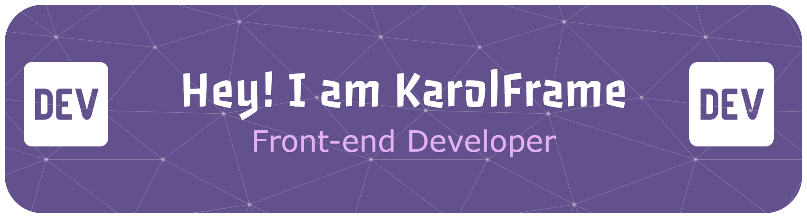

# Hi 👋
Hi, I'm **Carolina Pérez**, a **Frontend Developer** passionate about creating **clean, responsive, and interactive web experiences**. I love **learning new technologies**, solving problems, and making interfaces **intuitive and user-friendly**.  

- 🌱 I’m currently learning **Full Stack Development and Angular**  
- 👯 I’m looking to collaborate on **frontend projects**  
- 💬 Ask me about **React, HTML, CSS, JavaScript, Python, SQL, and Scrum**  
- 📫 How to reach me: **carolina.peseca@gmail.com**  
- 😄 Pronouns: **she/her**  

---

## 🌐 Socials:

  

---

## 💻 Frontend Skills (Main):

---

## 🛠 Backend & Databases:

  

---

## 🔄 Tools & Collaboration:

---

## ☁️ Cloud & Deployment (Secondary):

---

## 🎨 Design & Creative (Secondary):

---

## 🎮 Game Development (Secondary):

